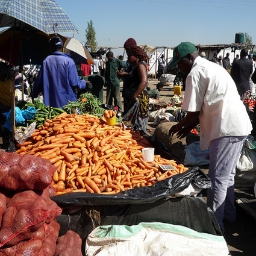
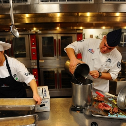
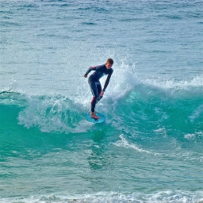
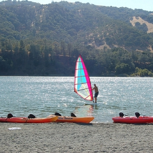
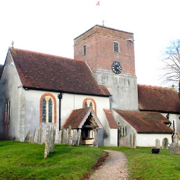
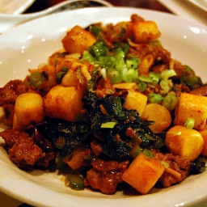
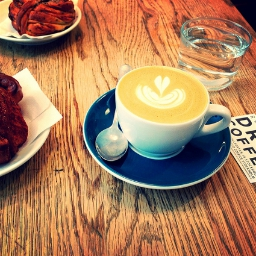
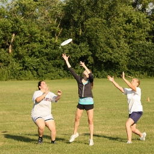
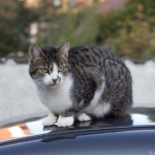
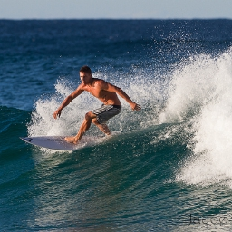

# OT-Alignment4brain-to-image

Candidate Descriptions: 

0 "People shopping in an open market for vegetables." 

1 "An open market full of people and piles of vegetables."

2 "People are shopping at an open air produce market."

3 "Large piles of carrots and potatoes at a crowded outdoor market."

4 "People shop for vegetables like carrots and potatoes at an open air market."

Neural Description: "A group of people standing around a counter in a restaurant."

Candidate Descriptions: 

0 "a couple of people are cooking in a room"

1 "Two people in chef's outfits cooking inside a kitchen."

2 "two chefs working on seperate parts of a meal at a restaurant"

3 "a couple of chefs standing in front of some food "

4 "A couple of cooks standing in a kitchen making food."

Neural Description: "A man is working in a kitchen, preparing food."

Candidate Descriptions: 

0 "A person in a wetsuit surfing on a turquoise wave."

1 "A male surfer riding a wave on the ocean."

2 "A young man with a surfboard at the ocean waters surfing"

3 "A surfer is riding the top of a wave."

4 "a person standing on a surfboard riding a wave"

Neural Description: "A surfer is riding a wave in the ocean."

Candidate Descriptions: 

0 "a windsurfer some water a hill sand and some kayaks"

1 "A windsurfer coming into a beach where kayaks await"

2 "there is a man wind surfing in a lake"

3 "A man is holding a small sail near the canoes."

4 "A man riding a sail board on a large lake."

Neural Description: "A black and white photo of the beach"

Candidate Descriptions: 

0 "A brick building with a clock on it and pathway."

1 "a church with a cemetery very close to the building"

2 "A large church with a tall brick clock tower in it's center."

3 "a very old abandon church with a grave yard"

4 "An old white and rust color building with a clock located in the middle."

Neural Description: "A tall clock tower sitting next to a tall building."

Candidate Descriptions: 

0 "a plate of yummy food of some kind"

1 "Food on a white plate with vegetables and a garnish."

2 "A cooked stir fry dish arranged on a plate."

3 "A picture of a bowl of food that is mostly vegetables."

4 "A close up picture of a meal on a white plate."

Neural Description: "A plate of food with broccoli, onions, and other vegetables."

Candidate Descriptions: 

0 "A cup of coffee on a plate with a spoon."

1 "A cappuccino cup next to plates of deserts."

2 "Cup of coffee with dessert items on a wooden grained table."

3 "A cup of liquid with a fancy design on top of it."

4 "Pastry, water and a cup of coffee with spoon."

Neural Description: "A white plate with a very tasty looking treat."

Candidate Descriptions: 

0 "Three young women are trying to catch a frisbee."

1 "A group of woman standing in a field trying to catch a frisbee"

2 "Three girls playing frisbee together in a field."

3 "3 people attempt to catch a frisbee in midair."

4 "three people in a grass field reaching for a frisbee in the air"

Neural Description: "A group of people in a grassy field with a frisbee."

Candidate Descriptions: 

0 "a cat is sitting on top of a vehicle"

1 "A cat sitting on top of a car near bushes."

2 "a black gray and white cat a car and bushes"

3 "Cat sitting on top of car with brush behind."

4 "A curious looking cat sitting on a car."

Neural Description: "A black and white image of a cat sitting on the floor."

Candidate Descriptions: 

0 "A man in swim shorts is riding a surf board."

1 "A surfer is riding a wave in the ocean."

2 "A fit young man surfing a wave in the ocean."

3 "A man riding a surfboard on a wave."

4 "A shirtless man riding shortboard on a wave."

Neural Description: "A man riding a wave on top of a surfboard."
